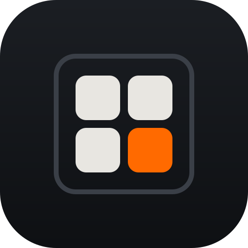
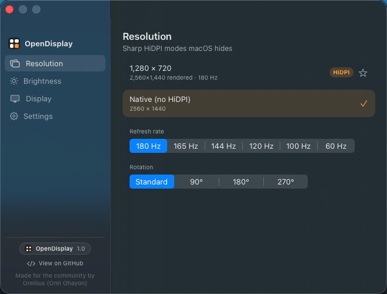

<p align="center">
  
</p>
<h1 align="center">OpenDisplay</h1>
<p align="center">A display control panel for macOS, in the menu bar.</p>
<p align="center">Brightness that keeps going after the panel's own floor, plus warmth, contrast, refresh rate, rotation, and the HiDPI modes macOS generates but never lists. No driver, no kernel extension.</p>

<p align="center">
  
</p>

---

macOS gives an external monitor two controls: a resolution list, and a brightness slider only if the panel answers DDC/CI. Everything else is either behind a private API or not exposed at all: the HiDPI modes the system generated and then filtered out of its own list, dimming past the point where the monitor stops, colour warmth, contrast, rotation. OpenDisplay reads the private SkyLight mode enumeration and applies modes through the *public* configuration call. Brightness, warmth and contrast are one live gamma transfer table that it restores on quit. Nothing is installed into the display path, and quitting the app puts the display back.

## Features

- **The HiDPI modes macOS hides on sub-4K panels**, from the menu bar, the control panel, or a scrub slider. Applied immediately and reapplied when the display reconnects. How many your panel actually has is a property of the panel, not of this app; see [Measured limits](#measured-limits).
- **Software brightness, warmth and contrast** as a single gamma transfer, restored on quit. Below the gamma floor, brightness continues into a translucent click-through overlay, so a monitor with no usable dimming of its own still gets true deep dim.
- **Refresh-rate switching**, in HiDPI and native modes alike.
- **Rotation**, on panels that report it supported, via the private MonitorPanel class.
- **A headless HiDPI virtual display** for remote access when no panel is attached.
- **A night schedule, idle dimming, presets, blackout and quick-reset**, plus global hotkeys for brightness and warmth with a glass or classic on-screen display.
- **Resolution protection**, which refuses to let an app or macOS change the mode out from under you, and a keep-awake that stops the display sleeping while OpenDisplay runs.
- **A Display pane** that reads panel identity and geometry: name, serial, PPI, EDID UUID, with copy and export.
- **An `opendisplay` command line, an `opendisplay://` URL scheme, and App Intents for Shortcuts.** The app binary *is* the CLI.
- Start at login, favourite resolutions pinned to the menu bar, a custom display name, settings export and import as JSON.
- No dependency, no driver, no kernel extension, no login daemon unless you ask for one.

## Install

### Requirements

- macOS 14 or later on **Apple Silicon**. Developed and tested on macOS 26.5.1.
- The Xcode command line tools: `xcode-select --install`.
- Full Xcode is optional and buys exactly one thing: Shortcuts. Only the Xcode build emits the const-value metadata that `appintentsmetadataprocessor` needs, so with the command line tools alone `bundle.sh` falls back to SwiftPM and prints a note saying so. Everything works except App Intents discovery, and the CLI and URL scheme still drive Shortcuts.

### Homebrew

```sh
brew tap orellius/tap
brew install opendisplay
```

A formula, not a cask, and it builds from source on your machine. That is the
point: a locally built bundle is never Gatekeeper-quarantined. The `opendisplay`
CLI lands on your PATH. Because Homebrew formulae install into the Cellar rather
than `/Applications`, link the bundle once:

```sh
ln -sfn "$(brew --prefix)/opt/opendisplay/OpenDisplay.app" /Applications/OpenDisplay.app
open /Applications/OpenDisplay.app
```

**The Homebrew build has no Shortcuts actions.** Only the Xcode build emits the
const-value metadata App Intents needs, and Homebrew's sandbox cannot run
`xcodebuild` (its dependency resolution shells out to `sandbox-exec`, which does
not nest). The CLI and the `opendisplay://` URL scheme still drive Shortcuts. For
App Intents, use the source install below.

### Build and install

```sh
git clone https://github.com/Orellius/opendisplay
cd opendisplay
scripts/install.sh
```

That builds a release binary, wraps it into `OpenDisplay.app`, ad-hoc signs it, replaces any copy already in `/Applications`, and launches it. A locally built bundle is not Gatekeeper-quarantined, so there is no "unidentified developer" prompt and nothing to right-click-open.

Building it yourself is the supported path, and not by accident: the app is signed ad-hoc rather than with a paid Developer ID, so a *downloaded* prebuilt copy would be quarantined until notarized. See [CONTRIBUTING.md](CONTRIBUTING.md).

To build without installing:

```sh
scripts/bundle.sh release   # produces ./OpenDisplay.app in the repo
swift run                   # run straight from source, no bundle
```

### First run

OpenDisplay has no Dock icon and no window. Look for the display icon in the menu bar.

- **Left click** drops the control panel. The Resolution pane is a scrub slider over the hidden HiDPI modes, plus a row for the native mode. On a panel that has none it says so outright instead of showing an empty list.
- **Nothing is written until you change something.** With no settings stored, the gamma table is the identity ramp and the app is inert.
- **Run `opendisplay list` before anything else.** It prints the HiDPI modes macOS is hiding on *your* panel, which is the one number that decides whether that feature has anything to give you.

### Start at login

Open the panel and turn on **Start at login**. This registers through `SMAppService`, which refuses apps whose signature does not verify, which is why `bundle.sh` signs the assembled bundle rather than relying on the linker's ad-hoc signature.

### Update

```sh
brew upgrade opendisplay              # Homebrew install
cd opendisplay && git pull && scripts/install.sh   # source install
```

The script quits the running copy first. Your settings survive: they live in `~/Library/Preferences/com.orellius.opendisplay.plist`, not in the bundle.

### Uninstall

```sh
osascript -e 'quit app "OpenDisplay"'
rm -f /Applications/OpenDisplay.app       # the symlink, if you made one
brew uninstall opendisplay                # Homebrew install
rm -rf /Applications/OpenDisplay.app      # source install
rm -f /usr/local/bin/opendisplay          # if you symlinked the CLI by hand
defaults delete com.orellius.opendisplay  # optional: forget settings
```

Nothing else is left behind. There is no driver, no kernel extension and no launch daemon: the gamma table is restored when the app quits, and a resolution it applied is an ordinary display mode that stands on its own.

### Troubleshooting

| Symptom | Cause |
|---|---|
| `opendisplay list` prints one line, or none | Your panel has no useful hidden HiDPI mode. macOS only generates oversized downsampled modes for 4K and up. This is the panel, not the app; see Measured limits. |
| The screen stays dim after a crash | Gamma is display-wide state owned by the window server. OpenDisplay restores it when it quits, but not after a `SIGKILL`. Relaunch it and use quick-reset, or run `open opendisplay://reset`. Quick-reset also returns the display to its native mode. Logging out clears the ramp too. |
| The monitor's own brightness does not move | The panel answers no DDC/CI reads, or DDC/CI is switched off in its on-screen menu. No software on the Mac can turn that on. `opendisplay caps` tells you which. |
| Rotation is greyed out | The panel does not report rotation support to MonitorPanel. |
| Text is still soft after switching modes | On a 1x panel the dominant cause is font smoothing, not resolution. Run `opendisplay smoothing 0`, then log out. |
| Shortcuts does not see the actions | Built without full Xcode. Rebuild with Xcode installed, or drive it from the CLI or URL scheme instead. |

## Command line

The app binary doubles as a CLI. Symlink it onto your PATH:

```sh
ln -s "/Applications/OpenDisplay.app/Contents/MacOS/OpenDisplay" /usr/local/bin/opendisplay
opendisplay help
```

```
opendisplay list                hidden HiDPI modes (* = current)
opendisplay modes               every mode, 1x and 2x, with its render size
opendisplay info                panel identity and geometry
opendisplay res 1920            set a HiDPI mode by looks-like width
opendisplay native              return to the native (non-HiDPI) mode
opendisplay brightness 60       software brightness 0-100
opendisplay warmth 30           color warmth 0-100
opendisplay contrast 40         contrast 0-100 (50 = neutral)
opendisplay refresh 120         refresh rate at the current resolution
opendisplay rotate 90           rotate the display (0, 90, 180, 270)
opendisplay smoothing 0         text dilation 0-3 or auto; 0 is sharpest on a 1x panel
opendisplay color show          the display's ICC profile, primaries and tone curve
                                also: color gamma <n> | color set <path> | color reset
opendisplay caps                the panel's DDC/CI capability string
opendisplay vcp 87              read a raw MCCS feature (add a value to write it)
opendisplay virtual 2560        create a headless HiDPI display and hold it
```

On a non-Retina external panel `smoothing 0` is the single largest sharpness change available. macOS has had no subpixel antialiasing since 10.14 and dilates glyph stems instead, and at ~108 PPI that dilation is what reads as soft. Apps pick the new value up on their next launch; the window server needs a logout.

`caps` and `vcp` are the honest way to find out what a monitor exposes over DDC/CI. Panels that ship with DDC/CI off in their on-screen menu answer nothing at all.

Wrap any of these in a Shortcuts "Run Shell Script" action to drive the display from Shortcuts. The bundled app also registers an `opendisplay://` URL scheme for links, Shortcuts' "Open URL", Raycast or Alfred:

```
opendisplay://brightness/50     opendisplay://warmth/30     opendisplay://contrast/40
opendisplay://res/1920          opendisplay://native        opendisplay://rotate/90
opendisplay://reset             opendisplay://blackout
```

## How it works

Two independent mechanisms. Neither one installs anything.

**Resolutions.** macOS builds a full mode list per display and then hands you a filtered copy.

```
 macOS builds the full mode list
   │
   ├─► CGDisplayCopyAllDisplayModes  public    HiDPI stripped   ─► System Settings
   │
   └─► SLDisplayCopyAllDisplayModes  private   HiDPI included   ─► OpenDisplay
                                                                     │
 CGConfigureDisplayWithDisplayMode  public  ◄────────────────────────┘
```

A HiDPI mode is one whose pixel dimensions are twice its point dimensions. OpenDisplay enumerates the private list, keeps those, and applies the chosen one with the ordinary public configuration call. The private surface is used to *see* modes, never to set them.

The SkyLight symbols are resolved at runtime with `dlsym` and every lookup is optional; MonitorPanel's `MPDisplay` is reached through `dlopen` plus `NSClassFromString`. If a future macOS renames them, the app reports the feature as unavailable instead of crashing. That surface has already been renamed once, from the `CGS*` names to `SL*`, so the guard is not theoretical.

**Brightness, warmth and contrast.** All three are one gamma transfer table on the whole display.

```
 brightness ─┐
 warmth ─────┼─► one 1024-entry ramp ─► CGSetDisplayTransferByTable ─► whole display
 contrast ───┘
 below the gamma floor, a translucent click-through overlay takes over
```

One consequence: the ramp is display-wide state owned by the window server, not by the app. OpenDisplay restores the identity ramp when it quits, so the failure mode of a crash is "the screen stays dim until you run `opendisplay reset`", never a wrong resolution or a lost display.

## Measured limits

Stated rather than implied. Measured on a Mac Studio driving a 27" LG ULTRAGEAR over DisplayPort, macOS 26.5.1, 2026-08-11.

- **How many hidden HiDPI modes you get is a property of your panel.** On this 2560x1440 panel macOS generates **exactly one**: looks-1280x720 rendered at 2560x1440. Every other mode in the private list is 1:1. There is no oversized downsampled mode, the "looks like 2560x1440, rendered at 5120x2880" trick, because Apple only generates those for 4K and up. If `opendisplay list` prints one line on your monitor, the HiDPI feature has nothing useful to give you and the rest of the app still does. That is the headline feature's real ceiling, and it is the first thing to check before you build.
- **HiDPI does not add pixels.** A HiDPI mode renders at 2x and downsamples to the panel's physical pixels. Text and edges get sharper; the panel is still 108 PPI against a Retina-class 218. The gain is largest on scaled-down modes, where the workspace is bigger and rendered at 2x.
- **Sharpness on a 1x panel is mostly font smoothing.** `opendisplay smoothing 0`, which sets `AppleFontSmoothing = 0`, is a larger visible change on this monitor than any mode switch available to it.
- **DDC on this panel is write-only.** Writes land: `vcp 10 75` visibly dimmed the LG and `vcp 10 100` restored it. Every MCCS read returns nothing, capability string included. So DDC has to be driven open-loop with state tracked locally. An earlier "DDC is dead here" reading was drawn from reads alone and was wrong.
- **Colour-profile assignment does not work here and is not offered.** `ColorSyncDeviceSetCustomProfiles` returns false for this display, and System Settings > Displays > Color Profile is the only path known to work. `ColorSyncDeviceCopyDeviceInfo` answers intermittently on macOS 26 and is not relied on: `opendisplay color show` reads through `CGDisplayCopyColorSpace` instead.
- **Gamma is display-wide and invisible to screenshots.** Brightness, warmth and contrast cannot be per-app or per-window, and a screen capture records the pre-gamma image. The overlay dim is the opposite: it is a real window, so screen recording does capture it.
- **`opendisplay virtual` is a topology change.** It creates a `CGVirtualDisplay` and holds it only while the command runs. Mirroring a real panel onto one can strand your only monitor, so do it deliberately.
- **One external display on Apple Silicon is what is tested.** The deployment target is macOS 14.0, but 14.x, Intel, internal panels and multi-monitor layouts are untested. Multi-monitor layout, HDR boost, and RGB/YCbCr pixel-encoding control are out of scope by design: on this class of panel they need either a destructive live-screen switch to verify or a private path that is not reliable enough to ship.

## Credits

Made for the community by **Orellius (Orel Ohayon)**, [github.com/Orellius](https://github.com/Orellius). <!-- allow-personal: the license attribution, published at the author's request -->

It includes a small amount of MIT-licensed code adapted from [MonitorControl](https://github.com/MonitorControl/MonitorControl), the DDC/CI packet framing in `DDC.swift`. That attribution is preserved in the source and in [NOTICE](NOTICE).

If OpenDisplay is useful to you, starring the repo is the whole ask.

## Contributing

Contributions are welcome, see [CONTRIBUTING.md](CONTRIBUTING.md). The project is AGPL and contributions are accepted under that license.

## License

AGPL-3.0-only. See [LICENSE](LICENSE) and [NOTICE](NOTICE). Forks must stay open and must preserve the attribution; the app checks its own copyright notice at launch and refuses to run without it.
